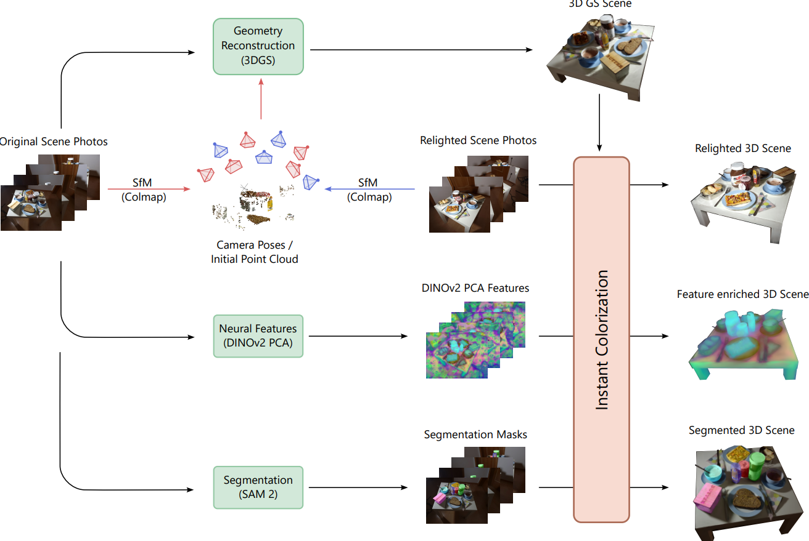
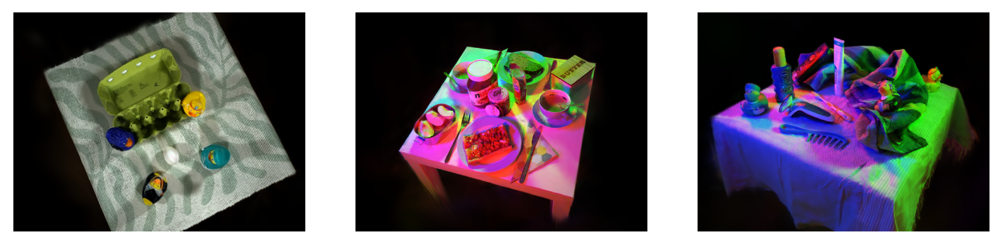
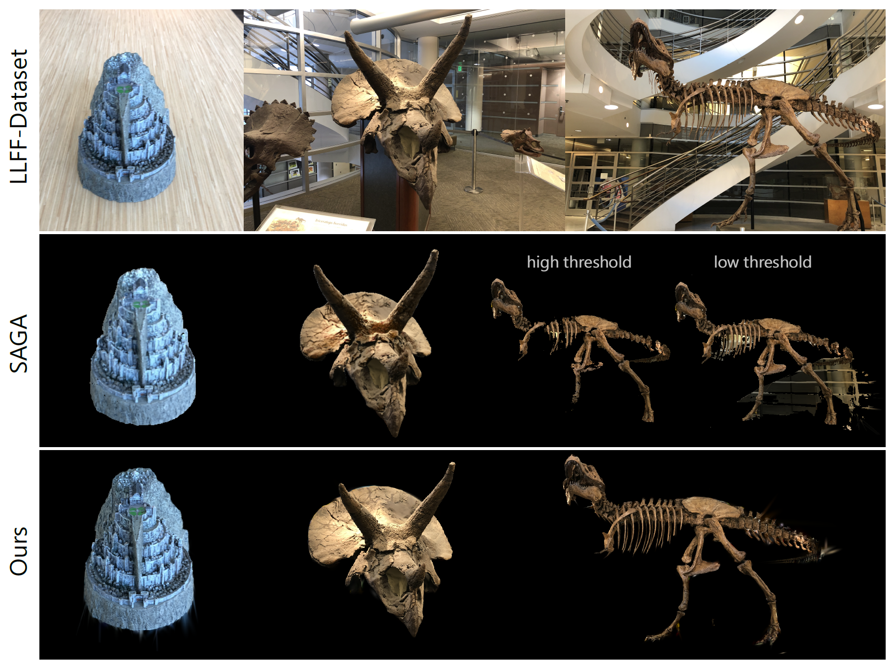

# Instant Colorization of Gaussian Splats
Daniel Lieber, Nils Wandel, Alexander Mock

This repository contains the official authors implementation associated with the paper "Instant Colorization of Gaussian Splats", which can be found [here](). 

Abstract: *Gaussian Splatting has recently become one of the most popular frameworks for photorealistic 3D scene reconstruction and rendering. While current rasterizers allow for efficient mappings of 3D Gaussian splats onto 2D camera views, this work focuses on mapping 2D image information (e.g. color, neural features or segmentation masks) efficiently back onto an existing scene of Gaussian splats. This 'opposite' direction enables applications ranging from scene relighting and stylization to 3D semantic segmentation, but also introduces challenges, such as view-dependent colorization and occlusion handling. Our approach tackles these challenges using the normal equation to solve a visibility-weighted least squares problem for every Gaussian and can be implemented efficiently with existing differentiable rasterizers. We demonstrate the effectiveness of our approach on scene relighting, feature enrichment and 3D semantic segmentation tasks, achieving up to an order of magnitude speedup compared to gradient descent-based baselines.*

<div style="text-align: center;">
  
</div>

<div style="display:flex; gap:10px; align-items:flex-start; flex-wrap:wrap;">

  <div style="flex:1 1 48%; min-width:300px;">
    
  </div>

  <div style="flex:1 1 48%; min-width:300px; display:flex; flex-direction:column; gap:10px;">
    
    
  </div>

</div>

# Installation Guide
### Cloning the Repository

The repository contains submodules, thus please check it out with 
```shell
# SSH
git clone  --recursive
```
or
```shell
# HTTPS
git clone  --recursive
```

This project builds on 3D Gaussian Splatting for Real-Time Radiance Field Rendering. [here](https://github.com/graphdeco-inria/gaussian-splatting)

## Follow their setup:

### Hardware Requirements

- CUDA-ready GPU with Compute Capability 7.0+
- 24 GB VRAM (to train to paper evaluation quality)
- Please see FAQ for smaller VRAM configurations

### Software Requirements
- Conda (recommended for easy setup)
- C++ Compiler for PyTorch extensions (we used Visual Studio 2019 for Windows)
- CUDA SDK 11 for PyTorch extensions, install *after* Visual Studio (we used 11.8, **known issues with 11.6**)
- C++ Compiler and CUDA SDK must be compatible

### Setup

#### Local Setup

Our default, provided install method is based on Conda package and environment management:
```shell
SET DISTUTILS_USE_SDK=1 # Windows only
conda env create --file environment.yml
conda activate gaussian_splatting
```
Please note that this process assumes that you have CUDA SDK **11** installed, not **12**. For modifications, see below.

Tip: Downloading packages and creating a new environment with Conda can require a significant amount of disk space. By default, Conda will use the main system hard drive. You can avoid this by specifying a different package download location and an environment on a different drive:

```shell
conda config --add pkgs_dirs <Drive>/<pkg_path>
conda env create --file environment.yml --prefix <Drive>/<env_path>/gaussian_splatting
conda activate <Drive>/<env_path>/gaussian_splatting
```

#### Modifications

If you can afford the disk space, we recommend using our environment files for setting up a training environment identical to ours. If you want to make modifications, please note that major version changes might affect the results of our method. However, our (limited) experiments suggest that the codebase works just fine inside a more up-to-date environment (Python 3.8, PyTorch 2.0.0, CUDA 12). Make sure to create an environment where PyTorch and its CUDA runtime version match and the installed CUDA SDK has no major version difference with PyTorch's CUDA version.

## Running

To run simply use

```shell
python colorize_instant.py --scene_path <path to folder containing point cloud>
```

<details>
<summary><span style="font-weight: bold;">Command Line Arguments for colorize_instant.py</span></summary>

  #### --source_path
  Path to the source directory containing a COLMAP data set.
  #### --iteration  (int, default: 30000)
  Which training iteration checkpoint to load. 
  #### --color_opt
  Color reconstruction method: "instant" or "adam"
  #### --refinement_steps  (int, default: 50)
  Number of refinement iterations after solver. 
  #### --sh_degree  (int, default: 50)
  Degree of spherical harmonics: 3 → standard rendering, 0 → for segmentation. 
  #### --save_loss  (bool, default: False)
  Save metrics + loss history to disk.
  #### --plot_images  (bool, default: False)
  Show live OpenCV visualization.
  #### --lighting_index
  Select lighting setup for multi-light datasets

</details>
<br>


<details>
<summary><span style="font-weight: bold;">Example Commands</span></summary>

  #### 1. Default Usage (Automatic Source Path)
  Runs colorization using the default settings. The source path is inferred automatically from the scene name.

  ```shell
  python colorize_instant.py \
  --scene_path output/horns \
  --iteration 30000
  ```

  #### 2. Custom Source Path
  Use this when the dataset directory does not match the scene folder name.

  ```shell
  python colorize_instant.py \
  --scene_path output/horns_experiment \
  --source_path data/horns \
  --iteration 30000
  ```

  #### 3. Segmentation Mode
  Uses only the DC component (no view-dependent effects). Suitable for segmentation masks.

  ```shell
  python colorize_instant.py \
  --scene_path output/scene_seg \
  --iteration 30000 \
  --sh_degree 0
  ```

  #### 4. Adam Optimization
  Optimizes colors using the adam optimizer.

  ```shell
  python colorize_instant.py \
  --scene_path output/horns \
  --iteration 30000 \
  --color_opt adam \
  --refinement_steps 0
  ```

  #### 5. Instant Solver with Refinement
  Runs the fast closed-form solver followed by additional refinement iterations.
  By default, **50 refinement steps** are performed unless specified otherwise.

  ```shell
  python colorize_instant.py \
  --scene_path output/horns \
  --iteration 30000 \
  --color_opt instant \
  --refinement_steps 100
  ```

  #### 6. Multi-Lighting Setup
  Select a specific lighting condition for datasets containing multiple lighting setups.

  ```shell
  python colorize_instant.py \
  --scene_path output/scene5_all \
  --iteration 30000 \
  --lighting_index 2
  ```

  #### 8. Logging and Evaluation Metrics
  Stores loss history and evaluation metrics (L1, L2, SSIM, PSNR).

  ```shell
  python colorize_instant.py \
  --scene_path output/horns \
  --iteration 30000 \
  --save_loss True
  ```

  #### 9. Custom Output File
  Stores loss history and evaluation metrics (L1, L2, SSIM, PSNR).

  ```shell
  python colorize_instant.py \
  --scene_path output/horns \
  --iteration 30000 \
  --output_file output/horns/colored_result.ply
  ```

</details>
<br>

For the segmentation you can use the following script to mask segmented gaussians:
```shell
python mask_ply.py --source_file <original point cloud> --mask_file <point cloud of the mask> --output_file <destination and name of the output>
```

<details>
<summary><span style="font-weight: bold;">Command Line Arguments for mask_ply.py</span></summary>

  #### --threshold
  The threshold sets the cutoff only Gaussians with values above it are kept.

</details>
<br>



## Processing your own Scenes

Following dataset structure in the scene path location:

```
<location>
|---point_cloud
|   |---<...>
|       |---point_cloud.ply
|   |...
|---cameras.json
|---cfg_args
|---exposure.json
|---input.ply
```

Following dataset structure in the source path location:

```
<location>
|---images
|   |---<image 0>
|   |---<image 1>
|   |---...
|---sparse
    |---0
        |---cameras.bin
        |---images.bin
        |---points3D.bin
```

<section class="section" id="BibTeX">
  <div class="container is-max-desktop content">
    <h2 class="title">BibTeX</h2>
    If you find this project helpful for your research, please consider citing the report
    <pre><code>,
      author       = {},
      title        = {Instant Colorization of Gaussian Splats},
      year         = {2026},
      url          = {}
}</code></pre>
  </div>
</section>